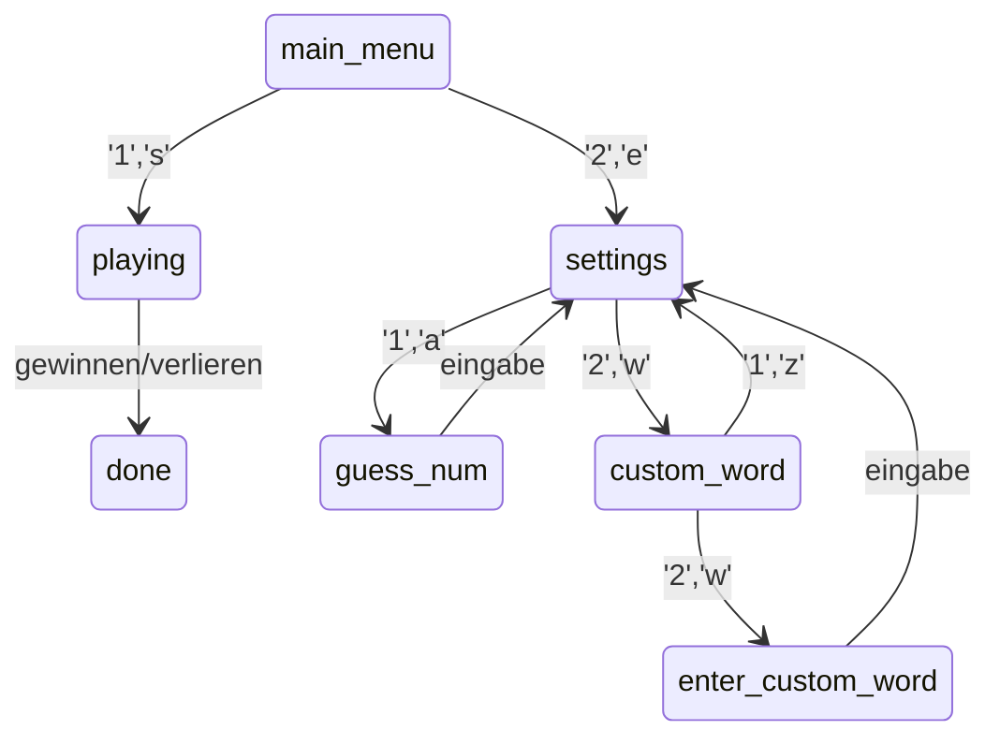
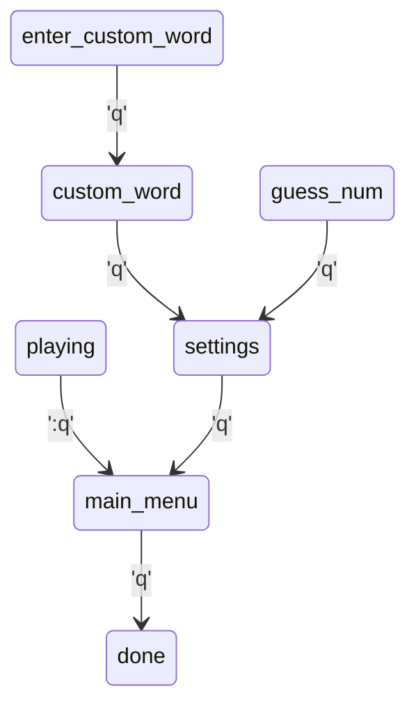

# SE - Galgenpersönchen

- [[#Planung]]
- [[#Umsetzung]]
- [[#Benutzeroberfläche und Benutzung]]

## Planung

### Anforderungen

- Konsolenbasiert
- Zufälliges oder von einem Spieler eingegebenes Wort
- Länge des Wortes ist bekannt
- richtig erratene Buchstaben anzeigen
  - an der entsprechenden Position im Wort (Dopplungen beachten)
- schon geraten Buchstaben anzeigen
- einstellen können, wie viele falsche Versuche man hat (Standard is 10)
- Wie oft wurde schon falsch geraten / wie oft darf man falsch raten
- Option nach Ende erneut zu spielen
- Komplettlösung möglich
  - bei richtiger Eingabe -> gewonnen
  - bei falscher Eingabe -> verloren

### Pflichten

- [[#Helferfunktionen]]
- [[#Main Loop]]
- [[#State-Machine|State-Machine designen]]
  - [[#Unterscheidung der Zustände|wie werden die unterschiedlichen Zustände unterschieden]]
  - [[#mögliche Zustände]]:
    - [[#main_menu|Hauptmenu]]
    - [[#playing|am spielen]]
    - [[#settings|Einstellungen]]
    - [[#guess_num|Anzahl der Versuche]]
    - [[#custom_word|Wort Festlegen Oder Zufällig Wählen]]
    - [[#enter_custom_name|Eigenes Wort eingeben]]
    - [[#done|Ende]]

## Umsetzung

Ich habe mich for die Agile Methode entschieden, da ich in der Vergangenheit schon mehrere software Projekte umgesetzt habe.
Dadurch war ich mir sicher dass ich die Struktur meines Programms quasi parallel zu der Implementierung festlegen kann.
Insgesamt würde ich sagen, dass diese Herangehensweise bei einem Projekt dieser Größe gut umsetzbar ist.
Allerdings denke ich auch, dass bei größeren Projekten diese Herangehensweise nicht praktikabel ist.

### Helferfunktionen

#### WRN

Die Helferfunktion `WRN()` gibt den übergebenen String `str` in Orange aus.

```python
def WRN(s: str) -> None:
  print(f"{text_color.ORANGE}{s}{text_color.END}")
```

#### UE

Die Helferfunktion `UE()` (UE = **U**nerwartete **E**ingabe) wird aufgerufen wenn eine Eingabe nicht den erwarteten Möglichkeiten entspricht.
Da dies an mehreren stellen passiert wird bei Änderung der Nachricht diese immer korrekt ausgegeben.

```python
def UE():
  WRN("Unerwartete Eingabe")
```

### Bevor das Spiel beginnt

Beim Start des Programmes wird der name ausgegeben.
Danach wird die Funktion `main()` erstmal ausgeführt.
Nachdem `main()` einmal ausgeführt wurde, wird diese immer wieder ausgeführt, wenn der Spieler dies möchte.

```python
if __name__ == "__main__":
  print(f"{text_color.CYAN}====HANG-DUDE===={text_color.END}\n\n")
  main()
  while True:
    i = input(f"{text_color.GREEN}ERNEUT SPIELEN? [J/n]{text_color.END}").lower()
    if i in ["yes", "y", "ja", "j", ""]: main()
    elif i in ["q", "no", "n", "nein"]: break
    else: UE()
```

### Main Loop

```python
def main() -> None:
  global use_random_word, word, state, prompts, win
 
  state = States.main_menu
  win = False
 
  if use_random_word:
    with open("./deutsch.txt") as f:
      word = (lambda x: x[floor(random() * len(x))])(f.readlines())[:-1]
  else: state = States.enter_custom_word

  while True:
    print("\033[2J")
    if state == States.playing or state == States.done:
      print(hung_dude[floor(guesses / (max_guesses / 10))])  # alle 10% kommt wird der Galgen erweitert

    i = input(prompts[state]()).lower()
    if [
      main_menu,
      settings,
      guess_num,
      custom_word,
      enter_custom_word,
      playing,
      done,
    ][state](i):
      break
```

erst wird das zu erratene Wort gewählt und dann eine `while True`-Schleife ausgeführt bis der Zustand `done` erreicht ist.

### State-Machine

Die State-Machine besteht aus Zuständen (Knotenpunkte) und Zustandsübergängen (Pfeile)



#### Unterscheidung der Zustände

Die State-machine hat eine Liste von möglichen Zuständen und eine Zustandsvariable (`state`).
--> `state` wird als index für die Liste der möglichen Zustände genutzt
alle möglichen Zustände sind in der `States`-Klasse festgehalten

```python
class States:
  done: int = -1
  main_menu: int = 0
  settings: int = 1
  guess_num: int = 2
  custom_word: int = 3
  enter_custom_word: int = 4
  playing: int = 5
```

Wenn `state` den Wert `States.done` annimmt wird aus der `while True`-Schleife ausgebrochen, da `done()` den Wert `True` zurück gibt.

```python
while True:
  i = input(prompts[state]()).lower()
  if [main_menu, settings, guess_num, custom_word, enter_custom_word, playing, done][state](i): break
```

> Eine grundlegende Voraussetzung sind first-class-functions in Python, wodurch eine Liste an Funktionen erstellet und indexiert werden kann.

Unabhängig vom Zustand muss es user input geben der verarbeitet werden soll (bei 'done' wird dieser nicht wirklich verarbeitet).
Die entsprechende Prompt (globale Variable `prompts`) wird auch vom Zustand (`state`) abhängig ausgegeben.

```python
global prompts, state
i = input(prompts[state]).lower()
[main_menu, playing, done][state](i)
```

> `prompts` ist eine Liste von Funktionen, da so die f-Strings jedes mal neu evaluiert werden

#### mögliche Zustände:

##### main_menu

```
---Hauptmenu---

  1. (S)piel starten
  2. (E)instellungen
```

##### playing

```
 ________
 |     ||
 |
 |
 |
 ꘍
/ \

schon geratene Buchstaben:
  a b c d e _ _ _ _ _ _ l _ _ _ p _ _ s t _ _ _ _ _ _

4 von 10 falschen Versuchen
[===>         ]

b e _ s p _ e l

Buchstabe oder Komplettlösung:
```

> hier mit dem Wort 'Beispiel' nach 4 falschen Versuchen

##### settings

```
---Einstellungen---

  1. (A)nzahl der Versuche
  2. (W)ort festlegen oder zufällig wählen
```

##### guess_num

```
---Anzahl Der Versuche---

  bitte eine Zahl zwischen 0-25 oder 's' für Standart (Standartwert ist 10, momentan 10)
```

##### custom_word

```
---Wort Festlegen Oder Zufällig Wählen---

  1. (Z)ufälliges Wort (momentan)
  2. (W)ort Festlegen/Multiplayer
```

##### enter_custom_word

```
---Wort Festlegen---

  Das Wort muss mehr als einen Buchstaben haben:
```

##### done

```
Du hast GEWONNEN :)
```

> Wenn `win` wahr (`True`) ist

```
Du hast VERLOREN :(
```

> Wenn `win` falsch (`False`) ist

## Benutzeroberfläche und Benutzung

### Multiple Choice

Optionen werden gelistet

```txt
---Menu-Titel---

1. (O)ption 1
2. (M)öglichkeit 2
```

Valide Eingaben für `Option 1` sind `1`, `1.`, `O` oder `o`.
Valide Eingaben für `Möglichkeit 2` sind `2`, `2.`, `M` oder `m`.

### Texteingabe

Im `playing` Zustand wird eine Eingabe mit nur einem Textzeichen als einzelner Buchstabe gewertet.
Wenn die Eingabe die gleiche Länge wie das gesuchte Wort hat, wird es als Komplettlösung gewertet.
Alle anderen Eingaben werden als invalide angesehen und nicht gewertet.

### "zurück"

Mit 'q' kann man eine Menu-Ebene zurück gehen.

Im playing Zustand wird die Eingabe 'q' als Versuch, den Buchstaben Q zu erraten, gewertet.
Daher muss dort eine andere Eingabe (':q') genutzt werden.


